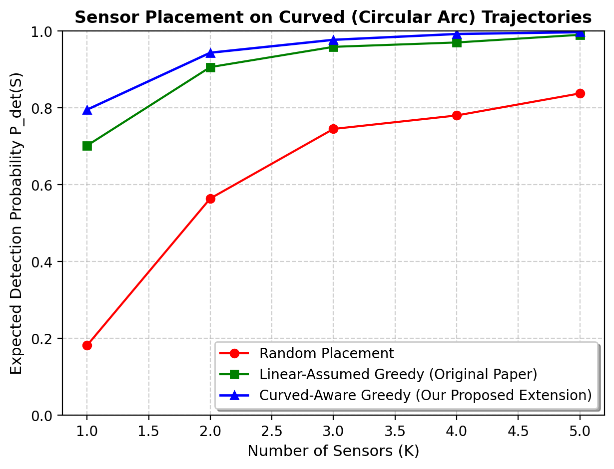
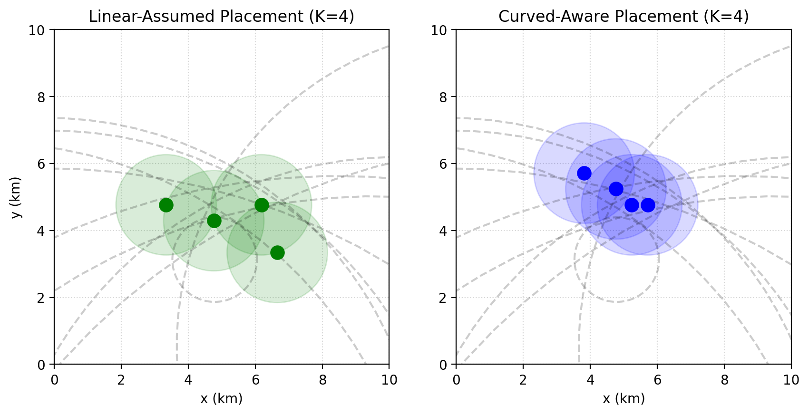

# Optimal Sensor Placement for Curved Target Trajectories

This repository contains the Python simulation code and mathematical formulation for extending stochastic target barrier coverage systems to curved (circular arc) target trajectories. This project was developed as a research task submission for the Department of Electrical and Computer Engineering.

## Project Overview
The original framework (Kim et al., IEEE SysCon 2025) optimizes sensor placement under linear stochastic trajectories modeled via a log-Gaussian Cox line process. This extension generalizes the formulation to circular arc trajectories parameterized in a 3-D representation space $\mathcal{C}' = (x_0, y_0, R)$. 

By mapping non-linear trajectories to discrete points in 3-D space and utilizing 3-D Kernel Density Estimation (KDE) for intensity estimation, we preserve the submodularity of the objective function, enabling near-optimal greedy sensor placement under realistic target motion models.

---

## Performance Results

### 1. Expected Detection Probability vs. Sensor Count ($K$)
The Curved-Aware Greedy placement consistently outperforms the Linear-Assumed baseline (original paper) by accounting for trajectory curvature in distance calculations.



### 2. Sensor Placement Visual Comparison ($K = 4$)
A comparison of placements highlights how the curved-aware strategy adjusts sensor positions to capture curved paths passing through the domain.



---

## Installation & Setup

1. **Clone the repository:**
   ```bash
   git clone https://github.com/Hamail-web/curved-sensor-placement.git
   cd curved-sensor-placement
